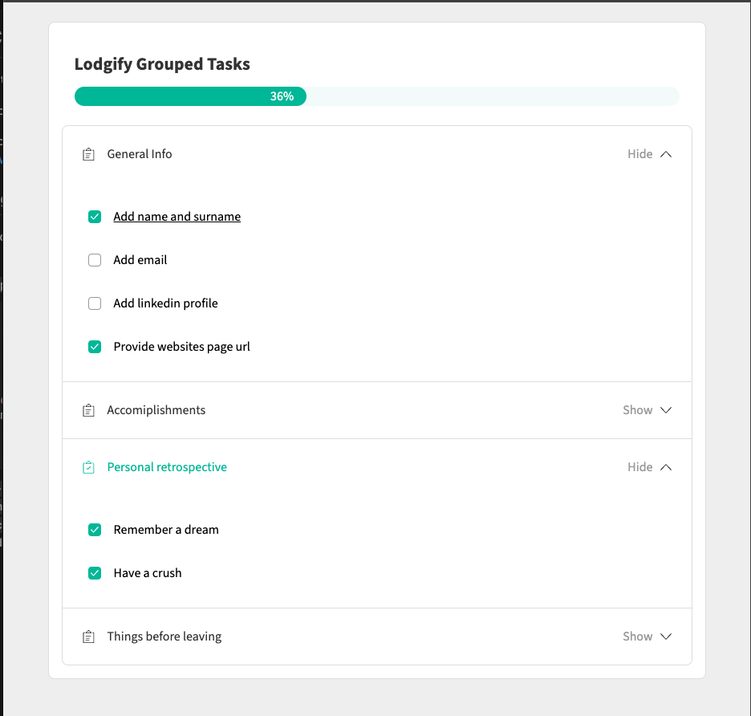

# Lodgify Accordion Challenge

## Description

This is a Frontned Challenge for Lodgify. It involves creating a Component to keep progress of user's tasks. The tasks are fetched from a static JSON file. The file contains a number of groups, each with a number of tasks. The tasks are displayed in an accordion format, where the user can expand and collapse the tasks. The user can also mark a task as completed. Each task has its own weight, which updates the progress bar differently depending on the task.

## Highlights

- Mobile-first layout.
- Keyboard and screen reader accessible. THe project uses both semanthic HTML and aria attributes.
- A few animations to make the user experience more pleasant.
- No external libraries used except for `styled-components`.

## Tech

The project is built on React and Typescript with Vite as a starter. It uses styled-components for styling. ESLint is used for linting.

## How to run

1. Clone the repository
2. Run `npm install`
3. Run `npm run dev`
4. Open `http://localhost:5173` in your browser if it doesn't open automatically.

## Scripts

- `npm run dev` - Start the development server
- `npm run lint` - Run ESLint
- `npm run test` - Run unit tests
- `npm run build` - Build the project
- `npm run preview` - Preview the production build
